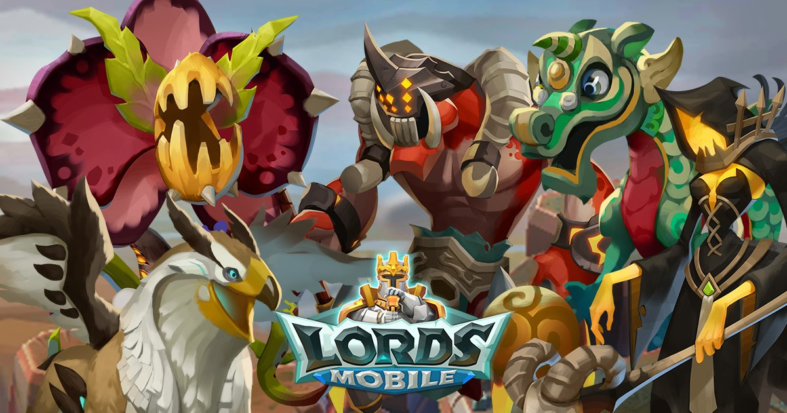

<br>
```{r setup, include=FALSE}
knitr::opts_chunk$set(echo = TRUE)
```


```{r, include=FALSE}
library(jpeg)
library(knitr)
```

```{r, echo=FALSE}

```

##**Monster Hunting Part 1: Personal Loot**
*Posted on March 13, 2019*

One of the long running debates in my Lords Mobile guild has been how to best benefit the entire guild when monster hunting.  As discussed in a [previous post](2019-01-30_LordsOverview.html), you get a certain amount of energy each day which can be used to hunt monsters on the map.  Each time you hunt a monster, you get a reward which can be a number of helpful things such as resources and materials.  If you reduce the monster's stamina to 0, you kill the monster and everyone in the guild receives a chest which contains one item.  The debate comes down to which level monsters should be hunted.  The level 1 monsters require the least amount of energy to kill but also have the smallest rewards.  Level 2 monsters require 6X-8X more energy to kill but have marginally, better rewards.  My guild has switched between various rules such as killing a minimum of 5 monsters of any level, killing only level 2 and 3 monsters and now killing only level 1 and 2 monsters with a minimum of 10 kills per day (with verifiable proof nonetheless!).

The current rule was based upon a spreadsheet of monster kill data.  I don't know the exact source of this data but it looks to have been collected in a reasonable manner and in wonderful detail.  The loot forecast based on the spreadsheet data suggests that killing level 1 and 2 monsters provides the most benefit for all guild members.  Level 1 monsters provide the most speedups and gold per energy and 2nd most gems and monster jewels.  Level 2 monsters provide the most gems and super-rare materials and 2nd most speedups and gold.  Level 3 monsters provide the most holy stars and relocators but the drop rates are low and there is a quite significant drop in speedups and gems per energy.  Level 4 monsters have the lowest drop rates per energy in everything and should be hunted only for special events.

This analysis did not convince a lot of guild members and the debate rages on.  Many people argue that they like getting "free" relocators (a 1500 gem value) which is only possible by hunting level 3 monsters.  There are also some valid arguments regarding the assumptions of the forecast which is based on a full guild of 100 members spending their maximum energy daily.  In this post, I perform some exploratory data analysis of the monster hunting data to better understand the composition of the data and potential bias in analyses based on this data.

```{r, include=FALSE}
library(tidyverse)
library(readxl)
```

```{r, include=FALSE}
#Read in data from spreadsheet and convert to tibble.
filename <- "lm_mh_raw_190218.xlsx"
folder <- "./data/"
numberCols <- 1 #total number of columns in spreadsheet

colTypes <- rep("text", numberCols)
raw1x <- read_excel(path = paste0(folder, filename), col_types = colTypes, col_names = FALSE)

#Parse the raw data
raw1x <- mutate(raw1x, id = rownames(raw1x))
temp <- raw1x %>% separate(X__1, c("mon", "lvl", "rwd1", "no1", "rwd2", "no2", "rwd3", "no3"), " ")

tmp1 <- temp %>% select(id, mon, lvl, rwd1, no1) %>% rename(reward = rwd1) %>% rename(quantity = no1)
tmp2 <- temp %>% select(id, mon, lvl, rwd2, no2) %>% rename(reward = rwd2) %>% rename(quantity = no2)
tmp3 <- temp %>% select(id, mon, lvl, rwd3, no3) %>% rename(reward = rwd3) %>% rename(quantity = no3)

mhunts <- bind_rows(tmp1, tmp2) %>% bind_rows(., tmp3)
rm(temp, tmp1, tmp2, tmp3)
```

###Hunts by Monster Level

```{r, echo=FALSE}
hunts_per_level <- mhunts %>% 
                    select(id, lvl) %>%
                    distinct() %>%
                    count(lvl)

g3 <- ggplot(hunts_per_level, aes(x=lvl, y=n)) +
        geom_bar(stat = "identity", fill="steelblue") +
        geom_text(aes(label = n), vjust=-0.3, size=3.5) +
        xlab("Monster Level") + ylab("No. of Hunts") +
        ggtitle("Distribution of Monster Hunts by Level") +
        theme_classic()

g3
```

The distribution of hunts by monster level is shown in the above figure.  The spreadsheet contained data for 12,507 hunts at the time of this analysis.  The majority of these hunts were for level 1 monsters (70%).  A decent number of level 3 and level 4 hunts are available (~700 each).  I should also note that there are level 5 monsters however the data has not yet been provided (presumably due to low counts).

###Hunts by Monster Type

There are currently 18 different monsters which routinely appear on the map for hunting.  Two different types of monsters are found on any given day and each monster stays for two days and then is switched for another type.  The next analysis looks at the distribution of hunts by monster type.  Some monster types have been in the game longer than others.  For example, the Frostwing monster was present with the launch of the game whereas the Hardrox monster was added only a few months ago.  The figure below shows the distribution of hunts by monster type and using a signature color for each monster because I am fancy like that.

```{r, include=FALSE}
huntsByType <- mhunts %>%
                select(id, mon, lvl) %>%
                distinct() %>%
                select(mon, lvl) %>%
                group_by(mon) %>%
                count(lvl) %>%
                ungroup() %>%
                group_by(mon) %>%
                summarize(hunts = sum(n)) %>%
                ungroup()

mnames <- c( "Bon Appeti", "Blackwing",  "Frostwing",   "Gargantuan",     "Gryphon", "Grim Reaper",  
            "Hell Drider",   "Hardrox",  "Jade Wyrm", "Mecha Trojan", "Mega Maggot", "Noceros",
              "Queen Bee", "Saberfang", "Snow Beast",  "Terrorthorn", "Tidal Titan", "Voodoo Shaman")
mcolor <- c(    "#FFCC99",   "#6600CC",   "#66FFFF",       "#996633",     "#33CCFF", "#FF6600", 
                "#CC0000",   "#CCCCCC",   "#33FF00",       "#CC9966",     "#CC9999", "#006600",
                "#FFFF33",   "#FFCC00",   "#FF0066",       "#CCFF33",     "#00CC99", "#00CC66")
huntsByType <- bind_cols(huntsByType, tibble(mnames = mnames, mcolors = mcolor)) %>%
                arrange(hunts) %>%
                mutate(mnames = fct_reorder(mnames, hunts)) %>%
                mutate(mcolors = fct_reorder(mcolors, hunts))
```

```{r, echo=FALSE}
g2 <- ggplot(huntsByType, aes(x=mnames, y=hunts, fill = mnames)) +
        geom_bar(stat = "identity") +
        scale_fill_manual(values = as.character(huntsByType$mcolors)) +
        coord_flip() +
        theme_minimal() +
        theme(legend.position = "none") +
        xlab("Monster") + ylab("# of Hunts") +
        ggtitle("Distribution of Hunts by Monster Type")
g2
```

The data contains about 3 times more hunts for the Voodoo Shaman monster than any other type.  Voodoo Shaman is one of the more recent monster types and its materials are needed for a new "Familiar" feature added to the game.  Obviously, this guild was focused on hunting these monsters during the data collection period.  The rest of the monsters are fairly evenly distributed except for the most recent monster, Hardrox.  Hardrox is the most difficult monster to kill and its materials make more specialized gear that most players are not focused on making.  The fact that the hunts are not evenly distributed amongst the monster types must be considered in future analyses.

###Drop Rate for Good Rewards by Monster Level

The next analysis looks at how frequently the most desired rewards are received from hunting different level monsters.  The most desired rewards, in my view, are regular and research speedups, gems, holy stars and ultra-rare materials.

```{r, include=FALSE}
#Define ultra-rare materials
ultrarare <- c("heart", "gcore", "bell", "orb", "seed", "eye",
               "toxin", "brain", "skull", "vial", "sucker", "geye",
               "blueprint", "venom", "halo", "pearl", "doll", "keystone")
#Classify the rewards
rewardClass <- mhunts %>%
          mutate(Category = case_when(is.na(reward) ~ "missing",
                                      reward %in% ultrarare ~ "Ultra-rare",
                                      str_detect(reward, "^[0-9].*[mh]$") ~ "Speedup",
                                      str_detect(reward, "^[0-9].*[mh]r$") ~ "Speedup",
                                      str_detect(reward, "^[0-9].*wall$") ~ "Wall Speedup",
                                      str_detect(reward, "^[0-9].*heal$") ~ "Heal Speedup",
                                      str_detect(reward, "gems$") ~ "Gems",
                                      str_detect(reward, "star$") ~ "Holy Stars",
                                      str_detect(reward, "food$") ~ "Rss",
                                      str_detect(reward, "stone$") ~ "Rss",
                                      str_detect(reward, "wood$") ~ "Rss",
                                      str_detect(reward, "ore$") ~ "Rss",
                                      str_detect(reward, "gold$") ~ "Gold",
                                      str_detect(reward, "shield$") ~ "Shield",
                                      str_detect(reward, "^chest") ~ "Hero Chest",
                                      str_detect(reward, "relocator$") ~ "Relocator",
                                      TRUE ~ "others"))
#Create table with only good rewards
good_rewards <- c("Speedup", "Gems", "Holy Stars", "Ultra-rare")
goodRewards <- rewardClass %>%
                  filter(Category %in% good_rewards) %>%
                  select(id, lvl, Category) %>%
                  distinct() %>%
                  group_by(lvl) %>%
                  count(Category) %>%
                  rename(Count = n) %>%
                  ungroup() %>%
                  left_join(., hunts_per_level, by = "lvl") %>%
                  mutate(droprate = round(Count/n * 100, 1))
goodRewards$Category <- fct_relevel(goodRewards$Category, c("Speedup", "Gems", "Holy Stars", "Ultra-rare"))
```

```{r, echo=FALSE}
g4 <- ggplot(goodRewards, aes(x=lvl, y=droprate, fill=Category)) +
        geom_bar(stat = "identity", position = "dodge") +
        geom_text(aes(label=paste0(droprate, "%")), position=position_dodge(width=0.9), vjust=-0.25, size=3) +
        theme_minimal() +
        scale_fill_hue(l=50) +
        xlab("Monster Level") + ylab("Drop Rate per Hit (%)") +
        ggtitle("Drop rate of most desired rewards per hit")

        
g4
```

As observed in the figure above, the drop rate for the most desired rewards generally increases slightly with the level of monster hunted.  In this case, the regular and research speedups are combined in one category and show up about a fourth of the time for level 1 and 2 monsters and about a third of the time for level 3 and 4 monsters.  The ultra-rare materials which are needed to forge the most desired gear are, in fact, very rare!  The drop rates for the ultra rare materials is only 0.3 (approximately 1 drop in every 333 hits).  This analysis doesn't take into account either the increased energy required to hunt higher level monsters nor the increased amount of each reward obtained from hunting higher level monsters.

###Average Expected Rewards Using Daily Energy by Monster Level

The next analysis takes into account the amount obtained in each reward item (e.g. 10 min, 15 min, 30 min, 1 hr speedup...) and the energy required to hunt the monster.  A daily energy expense equivalent to 40 level 1 monster hits was used in the calculations.  The amount of energy generated in a day will vary depending upon your monster hunting stats.  Monster hunting stats can depend on a number of factors including your gear, research and familiar development.


```{r, include=FALSE}
#Set energy equivalent to x number of lvl 1 hits
hits <- 40

#Regular speedups
speed <- mhunts %>%
          filter(str_detect(reward, "^[0-9].*[mh]$")) %>%
          mutate(id = as.numeric(id)) %>%
          arrange(id)

#Convert to speedup mins per energy
speed <- speed %>%
          separate(reward, into = c("time", "unit"), "(?<=[0-9])(?=[a-z])") %>%
          mutate(time = as.numeric(time)) %>%
          mutate(quantity = as.numeric(quantity)) %>%
          mutate(timefactor = case_when(unit == "m" ~ 1,
                                       unit == "h" ~ 60,
                                       TRUE ~ NA_real_)) %>%
          mutate(mins = time * timefactor * quantity) %>%
          mutate(levelfactor = case_when(lvl == "1" ~ 1,
                                         lvl == "2" ~ 1.667,
                                         lvl == "3" ~ 2.667,
                                         lvl == "4" ~ 4.667,
                                         TRUE ~ NA_real_)) %>%
          mutate(MinsPerEnergy = mins/levelfactor)

#Regular speedups per energy for XX lvl 1 equivalent hits
speed_summary <- speed %>%
                  group_by(id, lvl) %>%
                  summarize(TotalMins = sum(MinsPerEnergy)) %>%
                  ungroup()

speed_summary <- speed_summary %>%
                  group_by(lvl) %>%
                  summarize(TotalMins = sum(TotalMins)) %>%
                  ungroup()

speed_summary <- left_join(speed_summary, hunts_per_level, by = "lvl") %>%
                  mutate(MinsPerEnergy = TotalMins / n * hits)
```

```{r, include=FALSE}
#Research speedups
research <- mhunts %>%
              filter(str_detect(reward, "^[0-9].*[mh]r$")) %>%
              mutate(id = as.numeric(id)) %>%
              arrange(id)

#Convert to research speedup mins per energy
research <- research %>%
          separate(reward, into = c("time", "unit"), "(?<=[0-9])(?=[a-z])") %>%
          mutate(time = as.numeric(time)) %>%
          mutate(quantity = as.numeric(quantity)) %>%
          mutate(timefactor = case_when(unit == "mr" ~ 1,
                                       unit == "hr" ~ 60,
                                       TRUE ~ NA_real_)) %>%
          mutate(mins = time * timefactor * quantity) %>%
          mutate(levelfactor = case_when(lvl == "1" ~ 1,
                                         lvl == "2" ~ 1.667,
                                         lvl == "3" ~ 2.667,
                                         lvl == "4" ~ 4.667,
                                         TRUE ~ NA_real_)) %>%
          mutate(MinsPerEnergy = mins/levelfactor)

#Research Speedups per energy for xx lvl1 equivalent hits
research_summary <- research %>%
                      group_by(id, lvl) %>%
                      summarize(TotalMins = sum(MinsPerEnergy)) %>%
                      ungroup()

research_summary <- research_summary %>%
                      group_by(lvl) %>%
                      summarize(TotalMins = sum(TotalMins)) %>%
                      ungroup()

research_summary <- left_join(research_summary, hunts_per_level, by = "lvl") %>%
                      mutate(MinsPerEnergy = TotalMins / n * hits)
```

```{r, include=FALSE}
#Gems
gems <- mhunts %>%
          filter(str_detect(reward, "gems$")) %>%
          mutate(id = as.numeric(id)) %>%
          arrange(id)

#Convert to gems per energy
gems <- gems %>%
          separate(reward, into = c("amount", "unit"), "(?<=[0-9])(?=[a-z])") %>%
          mutate(amount = as.numeric(amount)) %>%
          mutate(quantity = as.numeric(quantity)) %>%
          mutate(levelfactor = case_when(lvl == "1" ~ 1,
                                         lvl == "2" ~ 1.667,
                                         lvl == "3" ~ 2.667,
                                         lvl == "4" ~ 4.667,
                                         TRUE ~ NA_real_)) %>%
          mutate(GemsPerEnergy = amount * quantity/levelfactor)

#Gems per energy for xx lvl1 equivalent hits
gems_summary <- gems %>%
                  group_by(id, lvl) %>%
                  summarize(TotalGems = sum(GemsPerEnergy)) %>%
                  ungroup()

gems_summary <- gems_summary %>%
                  group_by(lvl) %>%
                  summarize(TotalGems = sum(TotalGems)) %>%
                  ungroup()

gems_summary <- left_join(gems_summary, hunts_per_level, by = "lvl") %>%
                  mutate(GemsPerEnergy = TotalGems / n * hits)
```

```{r, include=FALSE}
#Holy Stars
stars <- mhunts %>%
          filter(str_detect(reward, "star$")) %>%
          mutate(id = as.numeric(id)) %>%
          arrange(id)

#Convert to holy stars per energy
stars <- stars %>%
          separate(reward, into = c("amount", "unit"), "(?<=[0-9])(?=[a-z])") %>%
          mutate(amount = as.numeric(amount)) %>%
          mutate(quantity = as.numeric(quantity)) %>%
          mutate(levelfactor = case_when(lvl == "1" ~ 1,
                                         lvl == "2" ~ 1.667,
                                         lvl == "3" ~ 2.667,
                                         lvl == "4" ~ 4.667,
                                         TRUE ~ NA_real_)) %>%
          mutate(StarsPerEnergy = amount * quantity/levelfactor)

#Holy Stars per energy for xx lvl1 equivalent hits
stars_summary <- stars %>%
                  group_by(id, lvl) %>%
                  summarize(TotalStars = sum(StarsPerEnergy)) %>%
                  ungroup()

stars_summary <- stars_summary %>%
                  group_by(lvl) %>%
                  summarize(TotalStars = sum(TotalStars)) %>%
                  ungroup()

stars_summary <- left_join(stars_summary, hunts_per_level, by = "lvl") %>%
                  mutate(StarsPerEnergy = TotalStars / n * hits)
```

```{r, include=FALSE}
per_energy <- tibble(lvl = speed_summary$lvl,
                     RegSpeeds = speed_summary$MinsPerEnergy,
                     ResSpeeds = research_summary$MinsPerEnergy,
                     Gems = gems_summary$GemsPerEnergy,
                     HolyStars = stars_summary$StarsPerEnergy
                     ) %>%
              gather("Item", "Quantity", 2:5)
```

```{r, echo=FALSE}
g5 <- ggplot(per_energy, aes(x=Item, y=Quantity, fill=lvl)) +
        geom_bar(stat = "identity", position = "dodge") +
        scale_x_discrete(labels = str_wrap(c("Gems", "Holy Stars", "Regular Speedups (min)", "Research Speedups (min)"), width = 10)) +
        geom_text(aes(label=round(Quantity, 0)), position=position_dodge(width=0.9), vjust=-0.25, size=3) +
        theme_minimal() +
        scale_fill_hue(l=50) +
        ggtitle("Average personal loot per day for hunting different level monsters") +
        xlab("") + ylab("Average personal loot")
g5
```

As observed in the figure above, the best average personal loot is obtained by hunting the level 4 monsters even when taking into account the high energy expenditure.  Gems increase almost 3x between level 1 and level 2 monsters with more moderate increase for higher level monsters.  Holy stars were significantly higher for the level 3 monsters compared with any of the other levels.  The regular speed-ups and research speed-ups were higher for level 3 and 4 monsters.  The total speedups (regular + research) for level 1 monsters was 4.5 hours/day compared to nearly 15 hours/day from level 4 monsters.

I did analyze, but did not include in the figure above, the number of ultra-rare materials expected each day.  For all of the different level monsters, the average ultra-rare material (i.e. the equivalent of 1 gray material) was less than 1 per day.  Since it is such an rare event, I do not feel there is enough data to conclusively say which level is better to hunt for ultra-rares.  The most data is available for level 1 monsters which average 0.2 ultra-rares per day.

###Conclusion
The best personal loot from hunting monsters is unquestionably obtained by hunting level 3 and 4 monsters.  You would expect to obtain, on average, about 3x more gems and speedups by hunting level 4 monsters compared to hunting level 1 monsters.  This analysis doesn't include the chance of obtaining relocators (level 3 and 4 only) and 24 hr shields (level 4 only) which cannot be obtained from hunting level 1 and 2 monsters.  

So, why are guilds requiring their members to hunt level 1 and 2 monsters?  To answer this question, we need to factor in the guild gifts which are received only after slaying the monster (i.e. reducing its energy to zero).  Slaying a level 4 monster is difficult and takes coordination among many guild members and/or the use of energy packs and you will get many fewer guild gifts from hunting level 3 and 4 monsters.  Analysis of the guild gifts obtained from monster hunting will be the subject of my next post.
