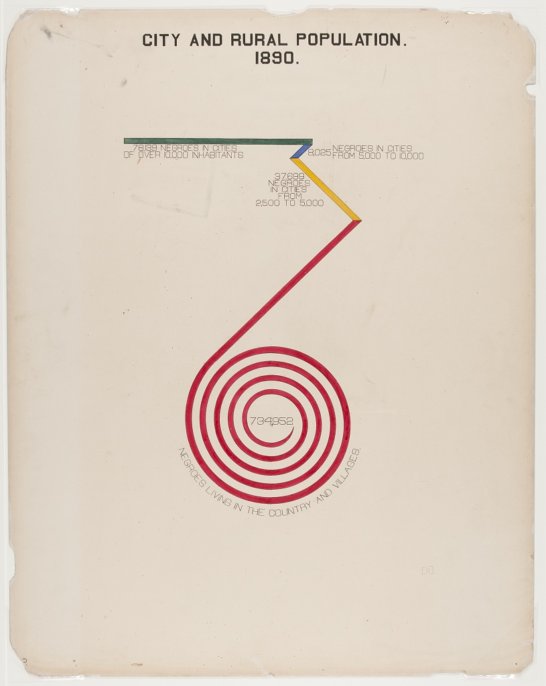

<br>

```{r setup, include=FALSE}
knitr::opts_chunk$set(echo = TRUE, 
                      fig.width = 6, fig.height = 6,
                      fig.showtext = TRUE)
```

```{r, include=FALSE}

library(tidyverse)
library(showtext)
library(jpeg)
theme_set(theme_minimal())
```

## **TidyTuesday: W.E.B. Du Bois Challenge**

*Posted on February 16, 2021*

A quick analysis of the weekly [\#TidyTuesday](http://github.com/rfordatascience/tidytuesday) dataset organized by the R4DS Online Learning Community. My approach is to apply my data science skills to explore one question I have about the data and generate a visualization that addresses this question. The main purpose for me is to practice and try out new things. I am never completely satisfied with the end result but I do the best I can in a short period of time.

**What I learned this week about R and the Tidyverse**

-   How to generate points for an Archimedean spiral
-   Plotting points in the listed order using geom_path
-   Adding a custom Google font using showtext package
-   Putting fig.showtext=TRUE into knitr::opts_chunk to render the Google font properly

**Brief explanation of the dataset**

This week's [\#TidyTuesday](http://github.com/rfordatascience/tidytuesday) was a bit different than normal. The assignment was to re-create one of W.E.B. Du Bois' data visualizations and aligned with the \#DuBoisChallenge. I chose Challenge \#6 which was an interesting design to demonstrate the number of Black persons living in urban versus rural areas of Georgia in 1890. This interesting figure is shown below:

```{r, echo=FALSE}

```

### Wrangle

I didn't even use the dataset directly as it was just four population numbers.

```{r}
readRDS("./data/tt_210216.rds")
```

The biggest challenge for me was to figure out how to generate the red spiral for this figure. I eventually came upon a formula to generate an Archimedean spiral and then switched the x and y points so that it would spin counterclockwise.

Create the points to generate the spiral.

```{r}
#Initialize
num_segments <- 1e4
radius <- 0
x <- vector(mode ="numeric", length = num_segments)
y <- vector(mode = "numeric", length = num_segments)
i <- 0

max_radius <- 1
delta_r <- max_radius / num_segments
spin_rate <- 10

#Create points
for (i in 1:(num_segments-1)) {
  #print(i)
  radius <- radius + delta_r
  x[i+1] <- x[i] + radius * sin((2 * pi * i / num_segments) * spin_rate)
  y[i+1] <- y[i] + radius * cos((2 * pi * i / num_segments) * spin_rate)
}
```

### Visualize

The tightness of the spiral (i.e. number of revolutions) increased by increasing the spin_rate. The size of the spiral could be increased by increasing the max_radius. The resolution (i.e. smoothness) of the spiral could be improved by increasing num_segments.

The raw spiral points used in the visualization are shown below.

```{r}
df <- tibble(x, y)

p <- df %>%
  ggplot(aes(x = x, y = y)) +
  geom_path(size = 3, linejoin = "round", lineend = "square", linemitre = "10", color = "red")

p
```

Some trimming was required in order to get the correct number of rotations and trim some of the inner part in order to display the population number. Trimming was accomplished by trial-and-error resulting in the following figure.

```{r}
spiral_df <- df %>%
  filter(row_number() > 2500 & row_number() < 7100)

spiral_df %>%
  ggplot(aes(x = x, y = y)) +
  geom_path(size = 3, linejoin = "round", lineend = "square", linemitre = "10", color = "red")
```

A Google font was selected that is somewhat close to the handwriting used in the Du Bois figure. The font was added to Windows using the google_add_font funcion from the showtext package.

```{r}
font_add_google(name = "Syncopate", family = "syncopate")
showtext_auto()
```

The figure was then constructed by connecting polygons to the spiral and adding the text.

```{r}
#Annotation settings
a_font <- "syncopate"
a_size <- 2

p <- ggplot() +
  geom_path(data = spiral_df, aes(x = x, y = y), size = 3, color = "#CC0000") +
  #geom_segment(aes(x = -100, y = 50, xend = 100, yend = 200), size = 5) +
  geom_polygon(aes(x = c(-99, -89, 105, 95), y = c(61, 61, 275, 275), fill = "A")) +
  geom_polygon(aes(x = c(95, 105, 55, 45), y = c(275, 275, 325, 325), fill = "B")) +
  geom_polygon(aes(x = c(45, 55, 80, 70), y = c(325, 325, 350, 350), fill = "C")) +
  geom_polygon(aes(x = c(80, 80, -175, -175), y = c(350, 360, 360, 350), fill = "D")) +
  annotate("text", x = 0, y = 0, label = "734,952", family = a_font) +
  annotate("text", x = -100, y = 345, label = "78,139 NEGROES IN CITIES", size = a_size, family = a_font) +
  annotate("text", x = -100, y = 335, label = "OF OVER 10,000 INHABITANTS", size = a_size, family = a_font) +
  annotate("text", x = 82, y = 335, label = "8,025", size = a_size, family = a_font) +
  annotate("text", x = 135, y = 340, label = "NEGROES IN CITIES", size = a_size, family = a_font) +
  annotate("text", x = 143, y = 330, label = "FROM 5,000 TO 10,000", size = a_size, family = a_font) +
  annotate("text", x = 35, y = 310, label = "37,699", size = a_size, family = a_font) +
  annotate("text", x = 35, y = 300, label = "NEGROES", size = a_size, family = a_font) +
  annotate("text", x = 35, y = 290, label = "IN CITIES", size = a_size, family = a_font) +
  annotate("text", x = 35, y = 280, label = "FROM", size = a_size, family = a_font) +
  annotate("text", x = 35, y = 270, label = "2,500 TO 5,000", size = a_size, family = a_font) +
  
  xlim(-200, 200) +
  scale_fill_manual(values = c("#CC0000", "#FFD700", "#330099", "#336600")) +
  labs(title = "CITY AND RURAL POPULATION.\n 1890.",
       caption = "Re-creation by @datadavidz | #DuBoisChallenge | #TidyTuesday") +
  theme(legend.position = "none",
        panel.grid = element_blank(),
        axis.text = element_blank(),
        axis.title = element_blank(),
        plot.title = element_text(hjust = 0.5),
        plot.background = element_rect(fill = "#EBD5B3"))

p
```

**Procedure for Adding a Curved Label under the Spiral**

The remaining part is to put the curved label at the bottom of the spiral. Unfortunately, curved text didn't appear to be an option in ggplot2 and I didn't immediately find a package that could integrate well with the figure already developed. I decided to write my own function to add the curved text. The idea was to use the data from the next outer revolution of the spiral as a guide for the text.

The idea was to add the text one-character-at-a-time and change the location and angle of the text to match the spiral.

**Step 1.** Trim the outer spiral loop to capture the points where the text should be placed.

```{r}
curve_text_path <- df %>% 
  filter(row_number() > 7600 & row_number() < 7900)

p + geom_point(data = curve_text_path, aes(x = x, y = y))
```

**Step 2.** Split the label into a vector of characters (42).

```{r}
curve_label <- "NEGROES LIVING IN THE COUNTRY AND VILLAGES"
curve_label_chars <- unlist(str_split(curve_label, ""))
```

**Step 3.** Define the x,y locations for each character. This was accomplished by taking the total number of points (300) and dividing by the number of characters (42). The result is taking every 7th point for a character location.

```{r}
curve_text_loc <- curve_text_path %>%
  arrange(x) %>%
  mutate(ind = rep(1:7, length.out = n())) %>%
  filter(ind == 1)
```

**Step 4.** Determine the angle for each character by the angle of points for the current character and the next character relative to the horizontal axis.

```{r}
curve_x <- curve_text_loc$x
curve_y <- curve_text_loc$y

i <- 0
curve_angle <- vector(mode = "numeric", length = 42)

for (i in 1:42) {
  curve_angle[i] <- atan((curve_y[i+1] - curve_y[i]) / (curve_x[i+1] - curve_x[i])) * 180 / pi 
}
```

**Step 5.** Create a function to add one character to the plot at the correct location and angle.

```{r}
curve_text <- function(p, x, y, angle, size, label) {
  return (p + annotate("text", x = x, y = y, angle = angle, size = size, label = label, hjust = 0.5, vjust = 0, family = a_font))
}
```

**Step 6.** Plot the curved label on to the final plot.

```{r}
i <- 0
p2 <- p

for (i in 1:42) {
  p2 <- curve_text(p2, curve_x[i], curve_y[i], curve_angle[i], a_size, curve_label_chars[i])
}

p2
```

### Summary

The final result was somewhat close to the original. It would have been nice to do more work to make the polygons more proportional to the data. The yellow polygon is clearly shorter than the original. The result from the curve_text function was a bit wonky. The spacing defined by every 7th point was not ideal and some unevenness is observed. Overall, I think not a bad attempt for a couple of hours of work.

